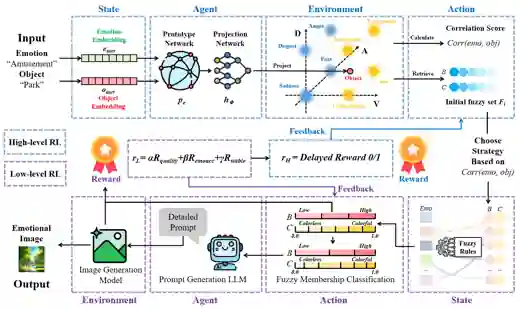
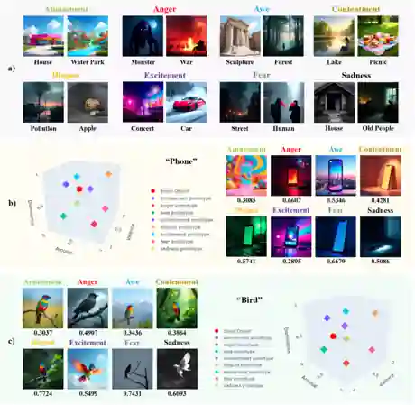
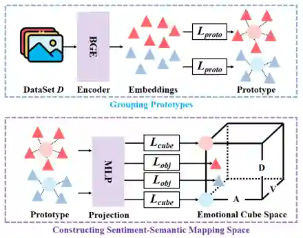
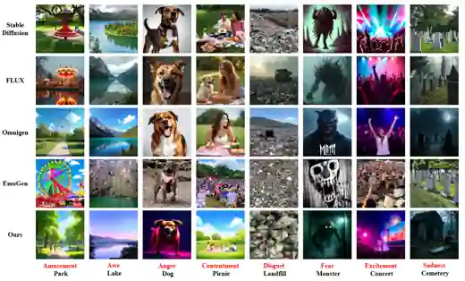
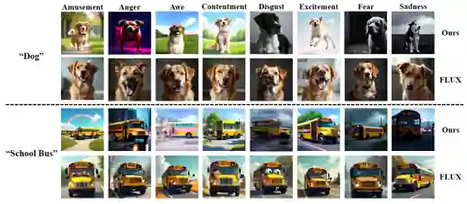

# EmoSENSE

**EmoSENSE** is a paper-aligned implementation of sentiment-semantic fuzzy hierarchical reinforcement learning for emotional image generation.

Given an emotion-object pair `(e, o)`, EmoSENSE builds a sentiment-semantic mapping space, retrieves emotion-specific visual attributes, refines fuzzy brightness/colorfulness rules with hierarchical RL, and generates the final image with OmniGen.

<p align="center">
  
</p>

<p align="center">
  
</p>

## Highlights

- VAD emotion cube with the paper's eight emotion vertices.
- Frozen BGE object encoder and MLP projection network for `corr(e, o)`.
- Top-K emotion-specific reference retrieval for brightness/colorfulness initialization.
- Low-level fuzzy rule refinement with Actor-Critic reinforcement learning.
- Qwen prompt generation and frozen OmniGen image generation.
- Paper defaults: `K=5`, `lambda=0.95`, `512x512`, `guidance_scale=2.5`, `50` inference steps.

## Repository Layout

```text
emosense/
  config.py       # emotion order, VAD vertices, runtime defaults
  mapping.py      # BGE prototypes, VAD projection, corr(e, o)
  fuzzy.py        # fuzzy labels, Fi initialization, Eq. 13 stability reward
  prompting.py    # Qwen prompt generator
  generation.py   # OmniGen wrapper
  rewards.py      # CLIPScore + emotion confidence reward
  rl.py           # hierarchical Actor-Critic pipeline
  cli.py          # command line interface
OmniGen/          # local OmniGen inference code
scripts/
  preprocess_emoset.py
tests/
assets/           # README figures
```

Large local artifacts are intentionally ignored by Git: `BGE/`, `mapping space/annotation/`, `projection/*.pth`, `projection/*.pt`, `projection/*.pkl`, `docs/*.pth`, `runs/`, and local model caches.

---

## 🧰 Step 0. Clone and Create Environment

```bash
git clone https://github.com/Junyiggg/EmoSENSE.git
cd EmoSENSE

conda create -n emosense python=3.10 -y
conda activate emosense

pip install -r requirements.txt
pip install -e .
```

If your PyTorch CUDA build does not match your GPU driver, install the correct PyTorch wheel first, then rerun `pip install -r requirements.txt`.

```bash
# Example for CUDA 11.8
pip install torch==2.3.1 torchvision==0.18.1 --index-url https://download.pytorch.org/whl/cu118
```

Run a quick import check:

```bash
python -m unittest discover -s tests
```

---

## 📦 Step 1. Install Required Models and Data

Create the local artifact folders:

```bash
mkdir -p model_cache projection docs "mapping space"
```

### 1.1 Download OmniGen

- Model page: [Shitao/OmniGen-v1](https://huggingface.co/Shitao/OmniGen-v1)
- Code reference: [VectorSpaceLab/OmniGen](https://github.com/VectorSpaceLab/OmniGen)

```bash
huggingface-cli download Shitao/OmniGen-v1 \
  --local-dir model_cache/OmniGen-v1
```

### 1.2 Download BGE

EmoSENSE uses BGE as the frozen semantic encoder for object text.

- Model page: [BAAI/bge-large-en-v1.5](https://huggingface.co/BAAI/bge-large-en-v1.5)

```bash
huggingface-cli download BAAI/bge-large-en-v1.5 \
  --local-dir BGE
```

### 1.3 Download Qwen

The paper uses LLaMA3.2-3B for prompt generation. This repository uses Qwen as requested.

- Hugging Face: [Qwen/Qwen2.5-3B-Instruct](https://huggingface.co/Qwen/Qwen2.5-3B-Instruct)
- ModelScope: [Qwen/Qwen2.5-3B-Instruct](https://modelscope.cn/models/Qwen/Qwen2.5-3B-Instruct)

You can let ModelScope cache Qwen automatically at first run, or download it manually:

```bash
modelscope download --model Qwen/Qwen2.5-3B-Instruct \
  --local_dir model_cache/Qwen2.5-3B-Instruct
```

### 1.4 Download EmoSet

The mapping space is trained from EmoSet annotations with brightness/colorfulness attributes.

- Project page: [EmoSet](https://vcc.tech/EmoSet)
- Paper: [EmoSet: A Large-scale Visual Emotion Dataset with Rich Attributes](https://arxiv.org/abs/2307.07961)

After downloading and extracting EmoSet, preprocess the annotation files:

```bash
python scripts/preprocess_emoset.py \
  --source-dir /path/to/EmoSet-118K/annotation \
  --dest-dir "mapping space/annotation" \
  --validation-ratio 0.1 \
  --random-seed 42
```

Expected output:

```text
mapping space/annotation/
  amusement/*.json
  awe/*.json
  ...
  splits/train.jsonl
  splits/validation.jsonl
  preprocess_metadata.json
```

### 1.5 Project-Specific Artifacts

For full RL generation, EmoSENSE needs:

```text
projection/cube_projection_weights.pth
projection/emotion_prototypes.pt
projection/prototypes.pkl
projection/mapping_metadata.json
docs/Clip_emotion_classifier.pth
```

You can obtain `projection/*` by running Step 2. The reward classifier `docs/Clip_emotion_classifier.pth` should be placed under `docs/`; publish or download it through the project [GitHub Releases](https://github.com/Junyiggg/EmoSENSE/releases) if you do not keep it locally.

---

## 🧭 Step 2. Train the Sentiment-Semantic Mapping Space

<p align="center">
  
</p>

Train the BGE prototype centroids and the VAD projection network:

```bash
python -m emosense.cli train-mapping \
  --annotation-dir "mapping space/annotation" \
  --output-dir projection \
  --bge-model BGE \
  --epochs 30 \
  --batch-size 64 \
  --embedding-batch-size 128 \
  --validation-ratio 0.1 \
  --random-seed 42 \
  --device cuda
```

For a quick smoke test:

```bash
python -m emosense.cli train-mapping \
  --annotation-dir "mapping space/annotation" \
  --output-dir projection_smoke \
  --bge-model BGE \
  --epochs 1 \
  --limit 800 \
  --device cuda
```

Inspect one object-emotion pair:

```bash
python -m emosense.cli inspect \
  --object "school bus" \
  --emotion disgust \
  --device cuda
```

The output includes:

- `correlation`: Euclidean distance from projected object to the target VAD vertex.
- `gamma`: `exp(-correlation)`, used as the stability coefficient.
- `closest_objects`: top-K emotion-specific references with brightness/colorfulness.

---

## 🎨 Step 3. Reinforcement Learning Image Generation

Run the full hierarchical RL generation pipeline:

```bash
python -m emosense.cli generate \
  --object "park" \
  --emotion amusement \
  --output-dir runs/amusement_park \
  --high-episodes 1 \
  --low-steps 5 \
  --inference-steps 50 \
  --qwen-model model_cache/Qwen2.5-3B-Instruct \
  --omnigen-model model_cache/OmniGen-v1 \
  --device cuda
```

If you use ModelScope/Hugging Face cache instead of local folders:

```bash
python -m emosense.cli generate \
  --object "cemetery" \
  --emotion sadness \
  --output-dir runs/sadness_cemetery \
  --high-episodes 1 \
  --low-steps 5 \
  --inference-steps 50 \
  --qwen-model Qwen/Qwen2.5-3B-Instruct \
  --omnigen-model Shitao/OmniGen-v1 \
  --device cuda
```

Expected output:

```text
runs/amusement_park/
  episode_01_step_01.png
  episode_01_step_02.png
  ...
  episode_01_rewards.jsonl
  summary.json
```

Use dry-run mode to validate mapping, fuzzy initialization, prompt assembly, and RL updates without loading OmniGen or CLIP:

```bash
python -m emosense.cli generate \
  --object "phone" \
  --emotion awe \
  --dry-run \
  --low-steps 2 \
  --device cuda
```

---

## Paper Examples

Qualitative comparison examples from the paper:

<p align="center">
  
</p>

Same-object emotion control examples:

<p align="center">
  
</p>

Run the Fig. 5 examples manually:

```bash
python -m emosense.cli generate --object "park" --emotion amusement --output-dir runs/amusement_park --inference-steps 50 --device cuda
python -m emosense.cli generate --object "lake" --emotion awe --output-dir runs/awe_lake --inference-steps 50 --device cuda
python -m emosense.cli generate --object "dog" --emotion anger --output-dir runs/anger_dog --inference-steps 50 --device cuda
python -m emosense.cli generate --object "picnic" --emotion contentment --output-dir runs/contentment_picnic --inference-steps 50 --device cuda
python -m emosense.cli generate --object "landfill" --emotion disgust --output-dir runs/disgust_landfill --inference-steps 50 --device cuda
python -m emosense.cli generate --object "monster" --emotion fear --output-dir runs/fear_monster --inference-steps 50 --device cuda
python -m emosense.cli generate --object "concert" --emotion excitement --output-dir runs/excitement_concert --inference-steps 50 --device cuda
python -m emosense.cli generate --object "cemetery" --emotion sadness --output-dir runs/sadness_cemetery --inference-steps 50 --device cuda
```

---

## Paper-Aligned Defaults

| Component | Default |
|---|---|
| Emotion order | `amusement, awe, contentment, excitement, anger, disgust, fear, sadness` |
| VAD vertices | Table II from the paper |
| Top-K references | `5` |
| Prompt LLM | `Qwen/Qwen2.5-3B-Instruct` |
| Prompt length | `max_new_tokens=50` |
| Image generator | `Shitao/OmniGen-v1` |
| Image size | `512x512` |
| Guidance scale | `2.5` |
| Inference steps | `50` |
| RL discount | `lambda=0.95` |
| Low-level reward | `alpha*Rclip + beta*Remo + gamma*Rstable` |
| Stability reward | `exp(-sqrt(mean(||s_t - s_{t-1}||_2^2)))` |

---

## Tests

```bash
python -m unittest discover -s tests
```

End-to-end smoke test:

```bash
python -m emosense.cli inspect --object "house" --emotion sadness --device cuda
python -m emosense.cli generate \
  --object "house" \
  --emotion sadness \
  --device cuda \
  --low-steps 1 \
  --inference-steps 10
```

Full paper-style generation should use `--inference-steps 50`.

---

## Notes for GitHub Users

- Do not commit local model weights, EmoSet annotations, generated images, or `__pycache__`.
- Store large artifacts in GitHub Releases, Hugging Face, ModelScope, or another artifact host.
- If you use Git LFS, `.gitattributes` already marks common model formats.
- CPU generation is possible but impractically slow for OmniGen; use an NVIDIA CUDA GPU for real experiments.

## Citation

If this repository is useful for your research, please cite the EmoSENSE paper and the upstream models/datasets used by your experiments.
