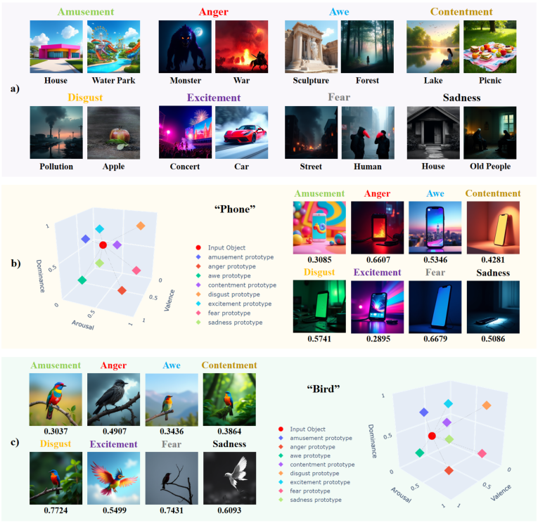
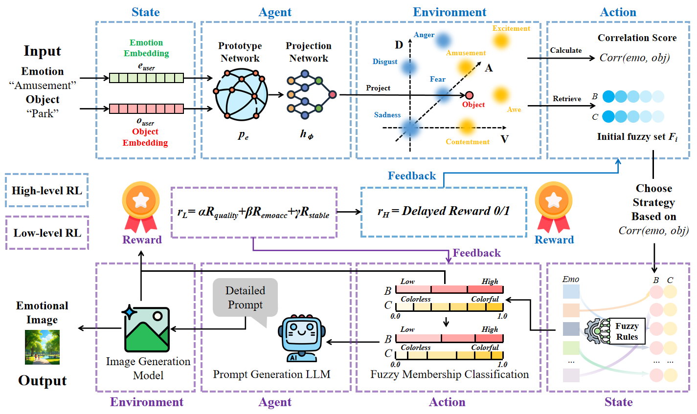
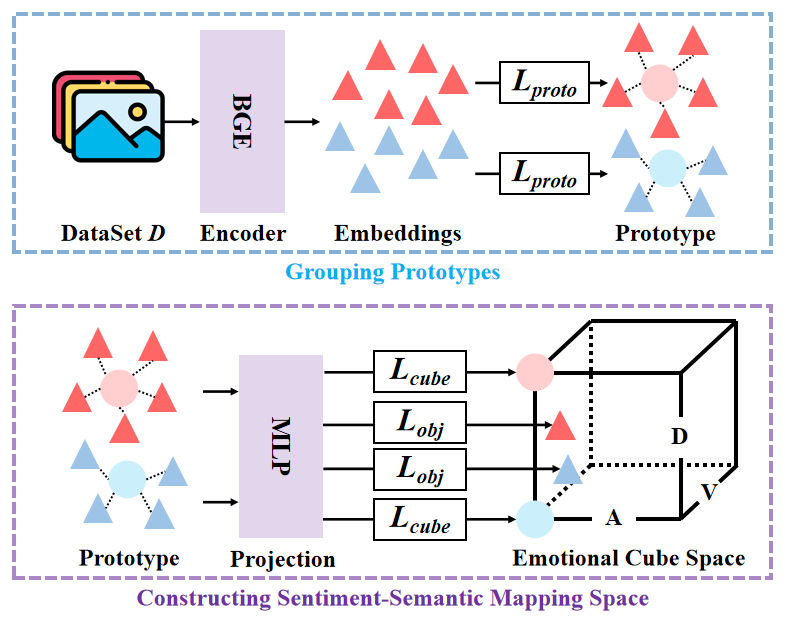

# EmoSENSE

Emotional image generation aims to create images that effectively reflect target emotions. A fundamental challenge in this task is the affective gap, which refers to the discrepancy between visual content and emotional states perceived by users. We propose **EmoSENSE**, a sentiment-semantic knowledge modeling framework with hierarchical fuzzy reinforcement learning for emotional image generation. 

<p align="center">
  
</p>


## Overview

Overview of our proposed method. The high-level module receives an emotion-object pair from user input. The proposed prototype maps the object into the VAD space with a prototype network to compute sentiment-semantic correlation. Then, the high-level module selects an initial fuzzy attribute subset and chooses a policy for the low-level module. The low-level module refines this subset by fuzzy membership classification. It produces a detailed attributes matrix and builds a detailed text prompt. This prompt guides a frozen image generation model and generates the final image.

<p align="center">
  
</p>

## Examples

Qualitative comparison examples from the paper:

<p align="center">
  
</p>

Same-object emotion control examples:

<p align="center">
  
</p>

## Repository Layout

```text
EmoSENSE/
├── emosense/
│   ├── config.py          # emotion order, VAD vertices, and runtime defaults
│   ├── mapping.py         # BGE prototypes, VAD projection, and corr(e, o)
│   ├── fuzzy.py           # fuzzy labels, Fi initialization, and stability reward
│   ├── prompting.py       # Qwen prompt generator and deterministic dry-run prompts
│   ├── generation.py      # frozen OmniGen image generation wrapper
│   ├── rewards.py         # CLIPScore and emotion-classifier rewards
│   ├── rl.py              # hierarchical actor-critic generation pipeline
│   └── cli.py             # train, inspect, and generate commands
├── OmniGen/               # local OmniGen inference code
├── scripts/
│   └── preprocess_emoset.py
├── tests/
├── assets/
│   ├── framework.png
│   ├── demo.png
│   ├── training.png
│   ├── qualitative-comparison.png
│   └── same-object.png
├── prompt.txt
├── requirements.txt
└── setup.py
```

Large local artifacts are intentionally ignored by Git: `BGE/`, `mapping space/annotation/`, `projection/*.pth`, `projection/*.pt`, `projection/*.pkl`, `docs/*.pth`, `runs/`, and local model caches.

## 🧰 Step 0. Clone and Create Environment

```bash
git clone https://github.com/Junyiggg/EmoSENSE.git
cd EmoSENSE

conda create -n emosense python=3.10 -y
conda activate emosense

pip install -r requirements.txt
pip install -e .
```

If your PyTorch CUDA build does not match your GPU driver, install the correct PyTorch wheel first, then rerun `pip install -r requirements.txt`.

```bash
# Example for CUDA 11.8
pip install torch==2.3.1 torchvision==0.18.1 --index-url https://download.pytorch.org/whl/cu118
```

Run a quick import check:

```bash
python -m unittest discover -s tests
```

## 📦 Step 1. Install Required Models and Data

Create the local artifact folders:

```bash
mkdir -p model_cache projection docs "mapping space"
```

### 1.1 Download OmniGen

- Model page: [Shitao/OmniGen-v1](https://huggingface.co/Shitao/OmniGen-v1)
- Code reference: [VectorSpaceLab/OmniGen](https://github.com/VectorSpaceLab/OmniGen)

```bash
huggingface-cli download Shitao/OmniGen-v1 \
  --local-dir model_cache/OmniGen-v1
```

### 1.2 Download BGE

EmoSENSE uses BGE as the frozen semantic encoder for object text.

- Model page: [BAAI/bge-large-en-v1.5](https://huggingface.co/BAAI/bge-large-en-v1.5)

```bash
huggingface-cli download BAAI/bge-large-en-v1.5 \
  --local-dir BGE
```

### 1.3 Download LLM

This implementation uses Qwen by default for prompt generation. The paper uses LLaMA3.2-3B, so both model links are listed for reproducibility.

- Qwen Hugging Face: [Qwen/Qwen2.5-3B-Instruct](https://huggingface.co/Qwen/Qwen2.5-3B-Instruct)
- Qwen ModelScope: [Qwen/Qwen2.5-3B-Instruct](https://modelscope.cn/models/Qwen/Qwen2.5-3B-Instruct)
- LLaMA Hugging Face: [meta-llama/Llama-3.2-3B-Instruct](https://huggingface.co/meta-llama/Llama-3.2-3B-Instruct)

You can let ModelScope cache Qwen automatically at first run, or download it manually:

```bash
modelscope download --model Qwen/Qwen2.5-3B-Instruct \
  --local_dir model_cache/Qwen2.5-3B-Instruct
```

### 1.4 Download EmoSet

The mapping space is trained from EmoSet annotations with brightness and colorfulness attributes.

- Project page: [EmoSet](https://vcc.tech/EmoSet)
- Paper: [EmoSet: A Large-scale Visual Emotion Dataset with Rich Attributes](https://arxiv.org/abs/2307.07961)

After downloading and extracting EmoSet, preprocess the annotation files:

```bash
python scripts/preprocess_emoset.py \
  --source-dir /path/to/EmoSet-118K/annotation \
  --dest-dir "mapping space/annotation" \
  --validation-ratio 0.1 \
  --random-seed 42
```

Expected output:

```text
mapping space/annotation/
├── amusement/*.json
├── awe/*.json
├── ...
├── splits/
│   ├── train.jsonl
│   └── validation.jsonl
└── preprocess_metadata.json
```

### 1.5 Project-Specific Artifacts

For full RL generation, EmoSENSE needs:

```text
projection/
├── cube_projection_weights.pth
├── emotion_prototypes.pt
├── prototypes.pkl
└── mapping_metadata.json
docs/
└── Clip_emotion_classifier.pth
```

You can obtain `projection/*` by running Step 2. Place `docs/Clip_emotion_classifier.pth` under `docs/`; publish or download it through the project [GitHub Releases](https://github.com/Junyiggg/EmoSENSE/releases) if you do not keep it locally.

## 🧭 Step 2. Train the Sentiment-Semantic Mapping Space

<p align="center">
  
</p>

Train the BGE prototype centroids and the VAD projection network:

```bash
python -m emosense.cli train-mapping \
  --annotation-dir "mapping space/annotation" \
  --output-dir projection \
  --bge-model BGE \
  --epochs 30 \
  --batch-size 64 \
  --embedding-batch-size 128 \
  --validation-ratio 0.1 \
  --random-seed 42 \
  --device cuda
```

For a quick training smoke test:

```bash
python -m emosense.cli train-mapping \
  --annotation-dir "mapping space/annotation" \
  --output-dir projection_smoke \
  --bge-model BGE \
  --epochs 1 \
  --limit 800 \
  --device cuda
```

Inspect one object-emotion pair:

```bash
python -m emosense.cli inspect \
  --object "school bus" \
  --emotion disgust \
  --device cuda
```

The output includes `correlation`, `gamma`, the projected object coordinate, and the top-K emotion-specific references with brightness/colorfulness attributes.

## 🎨 Step 3. Reinforcement Learning Image Generation

Run the full hierarchical RL generation pipeline:

```bash
python -m emosense.cli generate \
  --object "park" \
  --emotion amusement \
  --output-dir runs/amusement_park \
  --high-episodes 1 \
  --low-steps 5 \
  --inference-steps 50 \
  --qwen-model model_cache/Qwen2.5-3B-Instruct \
  --omnigen-model model_cache/OmniGen-v1 \
  --device cuda
```

If you use ModelScope or Hugging Face cache instead of local folders:

```bash
python -m emosense.cli generate \
  --object "cemetery" \
  --emotion sadness \
  --output-dir runs/sadness_cemetery \
  --high-episodes 1 \
  --low-steps 5 \
  --inference-steps 50 \
  --qwen-model Qwen/Qwen2.5-3B-Instruct \
  --omnigen-model Shitao/OmniGen-v1 \
  --device cuda
```

Expected output:

```text
runs/amusement_park/
├── episode_01_step_01.png
├── episode_01_step_02.png
├── ...
├── episode_01_rewards.jsonl
└── summary.json
```

Use dry-run mode to validate mapping, fuzzy initialization, prompt assembly, and RL updates without loading OmniGen or CLIP:

```bash
python -m emosense.cli generate \
  --object "phone" \
  --emotion awe \
  --dry-run \
  --low-steps 2 \
  --device cuda
```

## Tests

Step 3 runs the actual generation workflow. The commands below only check installation and core Python modules before heavy model loading.

```bash
python -m unittest discover -s tests
python -m emosense.cli --help
```

## Citation

```bibtex
@article{guo2026emosense, 
  title={EmoSENSE: Modeling Sentiment-Semantic Knowledge with Hierarchical Reinforcement Learning for Emotional Image Generation},
  author={Guo, Junyi and Chen, Hongjun and Wang, Qiufeng and Chen, Yaran and Cheng, Guangliang and Wu, Fangyu and Lim, Eng Gee},
  journal={IEEE Transactions on Affective Computing},
  year={2026},
  publisher={IEEE}
}
```
